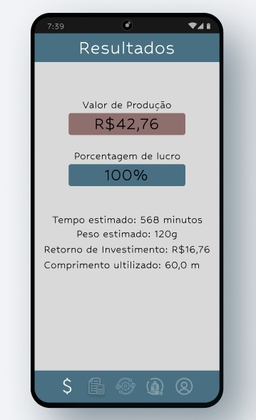

# Projeto de Interface

Pré-requisitos: <a href="2-Especificação do Projeto.md"> Documentação de Especificação</a>

Buscamos un desing intuitivo e simples focado no objetivo se propõe. Tendo uma barra na parte inferior com todas as abas para fácil acesso. Cada aba busca uma funcionalidade com vários campos de preenchimento, todas interagem entre si para que consigam mostrar o resultado que o usuário busca, esse resusltado é mostrado em sua última aba do aplicativo.

## Diagrama de Fluxo

O diagrama apresenta o estudo do fluxo de interação do usuário com o sistema interativo e  muitas vezes sem a necessidade do desenho do design das telas da interface. Isso permite que o design das interações seja bem planejado e gere impacto na qualidade no design do wireframe interativo que será desenvolvido logo em seguida.

## Wireframes

 
